<p align="center">
  
  
  
  
  
  
  
</p>

# MVP - Engenharia de Dados | Análise do Desempenho do São Paulo no Brasileirão 2024 e Identificação de possíveis Reforços

## 🎯 Objetivo do Projeto
Este projeto tem como objetivo construir um pipeline completo de Engenharia de Dados usando ferramentas amplamente utilizadas no mercado, como AWS S3, Databricks e Amazon Redshift, com foco em dados reais do Campeonato Brasileiro 2024.

A proposta é resolver, de forma estruturada, o seguinte problema de negócio:

> ### "Quais são os principais pontos fortes e fracos do desempenho do São Paulo FC ao longo da temporada, e quais reforços estatisticamente fariam sentido para a próxima temporada?"

Para isso, o projeto foi dividido em etapas claras, que envolvem:

- A coleta de dados públicos no Kaggle;
- A organização dos dados em um Data Lake (camadas Bronze, Silver e Gold);
- A modelagem de Data Marts por clube e por jogador;
- O carregamento para um Data Warehouse na nuvem (Amazon Redshift);
- E a análise final com base nas perguntas de negócio definidas no início.

Além de responder às perguntas, o projeto busca aplicar boas práticas de organização, versionamento, documentação e uso de ferramentas modernas em um fluxo completo de ETL com PySpark, entregando um produto final reutilizável, didático e voltado para portfólio profissional.

<br></br>
## 📚 Sumário

- [🚀 Tecnologias Utilizadas](#-tecnologias-utilizadas)
- [🔄 Pipeline do Projeto](#-pipeline-do-projeto)
- [📁 Estrutura de Pastas](#-estrutura-de-pastas)
- [📒 Notebooks do Projeto](#-notebooks-do-projeto)
- [🧭 Etapas do Projeto](#-etapas-do-projeto)
- [📊 Perguntas e Respostas do Projeto](#-perguntas-e-respostas-do-projeto)


<br></br>


## 🚀 Tecnologias Utilizadas

- **Databricks Community Edition**: para ingestão, transformação e tratamento dos dados com PySpark (ETL)
- **AWS S3**: armazenamento em Data Lake (Bronze, Silver, Gold)
- **Amazon Redshift Serverless**: utilizado como Data Warehouse para armazenar a camada Gold do projeto, estruturada em Data Marts temáticos focados em clubes, jogadores e métricas estatísticas.
- **PySpark + SQL**: para manipulação, modelagem e criação de data marts
- **GitHub**: versionamento e documentação do projeto


<br></br>


## 🔄 Pipeline do Projeto
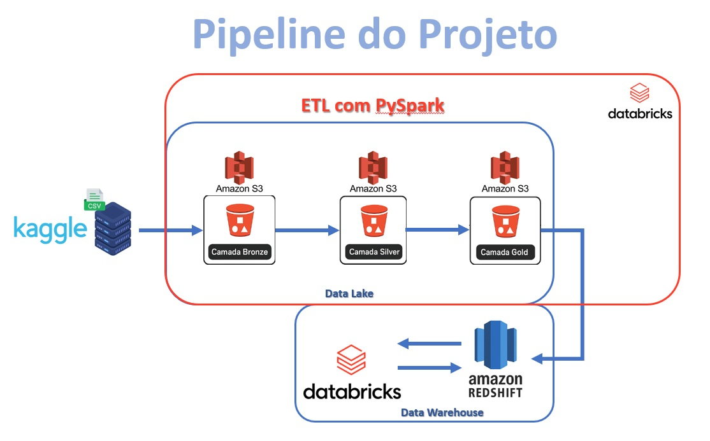


<br></br>


## 📁 Estrutura de Pastas

```plaintext
├── 📁 data/                → Contém os dados divididos por camadas do Data Lake
│   ├── 📂 bronze/          → Dados brutos, exatamente como foram recebidos (raw)
│   ├── 📂 silver/          → Dados tratados, limpos e padronizados
│   └── 📂 gold/            → Dados modelados prontos para análise e consumo (Data Marts)
|
├── 📁 notebooks/           → Notebooks com cada etapa do pipeline de dados
|
├── 📁 images/              → Diagramas, capturas de tela e elementos visuais do projeto
│   ├── 📂 AWS-Redshift/    → Imagens referente ao Redshift, para auxiliar no entendimento do processo
│   ├── 📂 AWS-S3/          → Imagens referente ao S3, para auxiliar no entendimento do processo
│   ├── 📂 icons/           → Icones personalizados para o README do GitHub
│   ├── 📂 notebook-images/ → Imagens que deverão ser anexadas nos notebooks
│   ├── 📂 pipeline/        → Imagem do Pipeline do Projeto
|
├── README.md              → Documentação geral do projeto
└── placeholder.txt        → Arquivo temporário para inicializar o repositório
```


<br></br>
## 📒 Notebooks do Projeto


| Ordem | Nome do Notebook | Descrição | Link |
|-------|------------------|-----------|------|
| 00 | `00-Configuracao.ipynb` | Leitura das credenciais, configuração do S3 e testes de conexão | [🔗](notebooks/00-Configuracao.ipynb) |
| 01 | `01-Catalogo de Dados no Metastore do Databricks Bronze.ipynb` | Criação do catálogo no Metastore com os dados brutos da camada Bronze | [🔗](notebooks/01-Catalogo%20de%20Dados%20no%20Metastore%20do%20Databricks%20Bronze.ipynb) |
| 02A | `02A-Ingestao-Bronze-TodasPartidas.ipynb` | Leitura e tratamento inicial do arquivo de partidas (ajuste de datas, nomes e tipos) | [🔗](notebooks/02A-Ingestao-Bronze-TodasPartidas.ipynb) |
| 02B | `02B-Ingestao-Bronze-Classificacao.ipynb` | Leitura da classificação final dos clubes, ajustes e criação da tabela na camada Silver | [🔗](notebooks/02B-Ingestao-Bronze-Classificacao.ipynb) |
| 02C | `02C-Ingestao-Bronze-EstatisticaJogadorPorPartida.ipynb` | Leitura e tratamento das estatísticas por jogador; limpeza e padronização de colunas | [🔗](notebooks/02C-Ingestao-Bronze-EstatisticaJogadorPorPartida.ipynb) |
| 02D | `02D-Correcao-Datas-e-Partidas-Ausentes.ipynb` | Correções manuais em datas e partidas ausentes nas estatísticas do campeonato | [🔗](notebooks/02D-Correcao-Datas-e-Partidas-Ausentes.ipynb) |
| 03 | `03-Catalogo de Dados no Metastore do Databricks Silver.ipynb` | Registro das tabelas tratadas da camada Silver no Metastore (com caminho S3) | [🔗](notebooks/03-Catalogo%20de%20Dados%20no%20Metastore%20do%20Databricks%20Silver.ipynb) |
| 04A | `04A-Transformacao-Gold-Mart-Clubes.ipynb` | Agregações, normalizações e criação do Mart com desempenho dos clubes na camada Gold | [🔗](notebooks/04A-Transformacao-Gold-Mart-Clubes.ipynb) |
| 04B | `04B-Transformacao-Gold-Mart-Jogadores.ipynb` | Criação do Mart com desempenho individual dos jogadores e informações complementares | [🔗](notebooks/04B-Transformacao-Gold-Mart-Jogadores.ipynb) |
| 04C | `04C-Transformacao-Gold-Mart_Info_Jogadores.ipynb` | Consolidação das funções e posições dos jogadores, jogos por função e versatilidade tática | [🔗](notebooks/04C-Transformacao-Gold-Mart_Info_Jogadores.ipynb) |
| 05 | `05-Catalogo de Dados no Metastore do Databricks Gold.ipynb` | Registro das tabelas tratadas da camada Gold no Metastore (com caminho S3) | [🔗](notebooks/05-Catalogo%20de%20Dados%20no%20Metastore%20do%20Databricks%20Gold.ipynb) |
| 06A | `06A-Carregamento-DW-Redshift-com-Databricks.ipynb` | Envio das tabelas da camada Gold do S3 para o Redshift via JDBC | [🔗](notebooks/06A-Carregamento-DW-Redshift-com-Databricks.ipynb) |
| 06B | `06B-Conexao-Databricks-com-DW-Redshift.ipynb` | Leitura das tabelas do Redshift diretamente no Databricks usando conexão JDBC | [🔗](notebooks/06B-Conexao-Databricks-com-DW-Redshift.ipynb) |
| 06C | `06C-Respostas.ipynb` | Respostas analíticas às perguntas do projeto, com consultas SQL e visualizações em Matplotlib | [🔗](notebooks/06C-Respostas.ipynb) |


### 📌 Observações
> 🔐 **Credenciais AWS** não estão incluídas no repositório por segurança.  
> O arquivo `aws_credentials.json` foi usado localmente para leitura via Spark no notebook `00-Configuracao`.

---


<br></br>


# 🧭 Etapas do Projeto


## 1. Configuração Inicial 🛠️
O projeto foi construído com base na integração entre `AWS` e `Databricks`, com o objetivo de aprofundar o uso dessas duas tecnologias.
<br>
Durante o processo de conexão do Databricks ao AWS S3, percebi que não seria seguro deixar as chaves de acesso expostas no código, já que qualquer usuário poderia visualizá-las.
<br>
Pensando em boas práticas e segurança, esta etapa inicial foi dedicada à configuração do ambiente, incluindo a criação de um arquivo
`aws_credentials.json`, que permite a conexão com a AWS de forma segura e controlada.

#### 1.A - Configuração das chaves de acesso | [00-Configuracao 📎](notebooks/00-Configuracao.ipynb)
- Criação da conta na AWS
- Criação do bucket S3 com as camadas bronze, silver e gold
- Criação de credenciais IAM e geração das chaves de acesso
- Armazenamento seguro das credenciais em um arquivo `.json`
- Configuração do acesso ao S3 no Databricks usando `spark.conf`


<br></br>


## 2. Extração dos Dados e Catalogação Inicial da camada Bronze 📦🥉
Nesta etapa, realizamos a extração dos dados brutos (raw) da fonte original (`Kaggle`), com armazenamento direto na camada Bronze do nosso Data Lake no S3 (`mvp-brasileirao-2024`).
<br>
Em seguida, iniciamos o processo de catalogação para entender a estrutura dos dados recebidos e decidir quais colunas seriam aproveitadas nas próximas etapas do pipeline.

#### 2.A - Extração dos Dados e armazenamento no AWS S3 |  [Arquivos da camada Bronze](https://github.com/Cavalheiro93/mvp-brasileirao-data-engineering/tree/main/data/bronze)
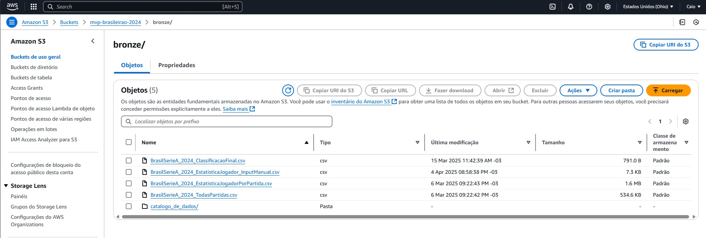

#### 2.B  Catálogo da Camada Bronze | [01-Catalogo de Dados no Metastore do Databricks Bronze📎](notebooks/01-Catalogo%20de%20Dados%20no%20Metastore%20do%20Databricks%20Bronze.ipynb)  
- Criação do catálogo no Metastore do Databricks com os dados brutos (raw) armazenados na camada Bronze
- Registro do nome dos campos, tipo e respectivas descrições de cada um deles
- Adição de atributos informativos: valores mínimos e máximos, total de registros, registros nulos e registros distintos
- Detalhamento da fonte dos dados: link da origem, nome do arquivo original e nome utilizado no Databricks/S3


<br></br>


## 3. Processamento da Camada Silver: Limpeza, Transformação e Catalogação 🧹🥈
Após a extração e armazenamento dos dados brutos na camada Bronze, esta etapa é dedicada à preparação dos dados para consumo analítico.
<br>
Realizamos a limpeza, padronização e transformação de cada uma das tabelas originais, tratando problemas como colunas irrelevantes, formatações inconsistentes e divergências nas datas das partidas.
<br>
Ao final do processo, os dados tratados são armazenados na camada Silver do Data Lake no formato Delta e Parquet e, em seguida, registrados no Metastore do Databricks com o caminho S3, possibilitando consultas diretas via SQL.


#### 3.A - Transformação dos Dados e armazenamento no AWS S3 (Parquet e Delta) | [Arquivos da camada Silver](https://github.com/Cavalheiro93/mvp-brasileirao-data-engineering/tree/main/data/silver)
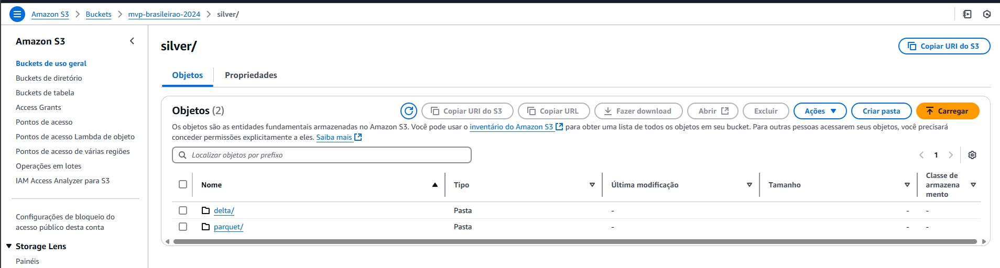


#### 3B. Ingestão Bronze - Todas as Partidas | [02A-Ingestao-Bronze-TodasPartidas📎](notebooks/02A-Ingestao-Bronze-TodasPartidas.ipynb)  
- Leitura do arquivo `BrasilSerieA_2024_TodasPartidas.csv` na Bronze
- Remoção de colunas irrelevantes (ex: colunas com odds de apostas)
- Filtragem da temporada **2024** apenas.
- Remoção de linhas duplicadas e com dados ausentes críticos
- Criação das colunas:
  - `Match_ID`: identificador único da partida
  - `Trimestre`: com base na data da partida
  - `Turno`: para indicar se é 1º ou 2º turno do campeonato
- Armazenamento do DataFrame tratado na **camada Silver** no formato Parquet


#### 3C. Ingestão Bronze - Classificação Final | [02B-Ingestao-Bronze-Classificacao📎](notebooks/02B-Ingestao-Bronze-Classificacao.ipynb)
- Leitura do arquivo `BrasilSerieA_2024_ClassificacaoFinal.csv` na Bronze
- Renomeação de colunas para padronização
- Criação de um dicionário de clubes, para padronizar os nomes
- Armazenamento do DataFrame tratado na **camada Silver** no formato Parquet


#### 3D. Ingestão Bronze - Estatísticas por Jogador e Partida | [02C-Ingestao-Bronze-EstatisticaJogadorPorPartida📎](notebooks/02C-Ingestao-Bronze-EstatisticaJogadorPorPartida.ipynb)
- Leitura do arquivo `BrasilSerieA_2024_EstatisticaJogadorPorPartida.csv` na Bronze
- Remoção de colunas irrelevantes ou redundantes
- Renomeação de colunas para padronização
- Criação de um dicionário de clubes, para padronizar os nomes
- Correção no Tipo de Dado de algumas colunas
- ⚠️ Idade do Jogador 'Felipe Vieira' (Fluminense) estava vazia, e portanto foi ajustada manualmente baseando-se no site https://www.ogol.com.br/jogador/felipe-andrade/620537?epoca_id=153
- ⚠️ Input manual das Partidas que estavam pendentes no arquivo original:
  - Fluminense x Grêmio (01/11/2024), informações baseada no site: https://fbref.com/pt/partidas/bb1a4828/Fluminense-Gremio-2024Novembro1-Serie-A
  - Atlético-MG x Athletico-PR (07/12/2024), informações baseada no site: https://fbref.com/pt/partidas/fd4de3a4/Atletico-Mineiro-Athletico-Paranaense-2024Dezembro8-Serie-A
  - Input foi feito através do arquivo `BrasilSerieA_2024_EstatisticaJogador_InputManual.csv`
- Armazenamento do DataFrame tratado na **camada Silver** no formato Parquet


#### 3E. Correção de Datas e Partidas Ausentes | [02D-Correcao-Datas-e-Partidas-Ausentes📎](notebooks/02D-Correcao-Datas-e-Partidas-Ausentes.ipynb)
- Identificação de divergências entre datas de partidas nos arquivos de estatísticas e todas as partidas
- Identificação do padrão onde as datas diferentes das partidas são de -1 dia
- Correção das datas incorretas com base no dataset validado (fbref.com)
- Armazenamento do DataFrame final corrigido na camada Silver no formato Parquet


#### 3F. Catálogo da Camada Silver | [03-Catalogo de Dados no Metastore do Databricks Silver📎](notebooks/03-Catalogo%20de%20Dados%20no%20Metastore%20do%20Databricks%20Silver.ipynb)
- Criação do Database específico para os dados tratados (camada Silver)
- Conversão dos arquivos tratados de .parquet para o formato Delta
- Registro das tabelas da camada Silver no Metastore com o caminho no S3


<br></br>


## 4. Transformações Analíticas para Camada Gold e Catálogo de Dados 🧪🥇
Nesta etapa, consolidamos os dados tratados da camada Silver e criamos as primeiras tabelas analíticas do nosso **Data Warehouse**.

A Camada Gold será responsável por organizar os dados de forma otimizada para consumo analítico, através de **Data Marts** modelados por clube e por jogador, além de outras tabelas complementares.

O Catálogo de dados da Camada Gold foram registrados no **Metastore do Databricks** com caminho no S3, permitindo consultas SQL e integração com ferramentas analíticas.

#### 4A. Transformações Analíticas: Enriquecendo os dados da Silver para Gold e armazenamento no AWS S3 | [Arquivos da camada Gold](https://github.com/Cavalheiro93/mvp-brasileirao-data-engineering/tree/main/data/gold)
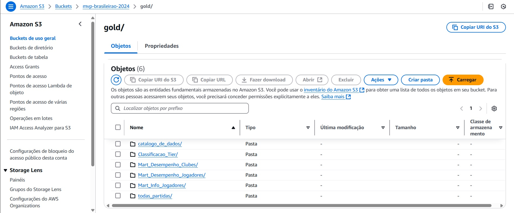

#### 4B. Transformação por Clube | [04A-Transformacao-Gold-Mart-Clubes](notebooks/04A-Transformacao-Gold-Mart-Clubes.ipynb)  
- Leitura dos Arquivos no DBFS (Para diminuir o custo da AWS S3)
- Criação de Views Temporárias
- Criação de métricas de normalização
- Criando pesos para cada uma dessas métricas
- Criando um Score beseado na soma dessas métricas de normalização, para o resultado final do desempenho do clube


#### 4C. Transformação por Jogador | [04B-Transformacao-Gold-Mart-Jogadores](notebooks/04B-Transformacao-Gold-Mart-Jogadores.ipynb)
- Leitura dos Arquivos no DBFS (Para diminuir o custo da AWS S3)
- Criação de Views Temporárias
- Criação de métricas de normalização
- Criando pesos para cada uma dessas métricas
- Criando um Score beseado na soma dessas métricas de normalização, para o resultado final do desempenho do Jogador


#### 4D. Informações Complementares dos Jogadores | [04C-Transformacao-Gold-Mart_Info_Jogadores.ipynb](notebooks/04C-Transformacao-Gold-Mart_Info_Jogadores.ipynb)
- Leitura dos Arquivos no DBFS (Para diminuir o custo da AWS S3)
- Mapeamento das posições dos Jogadores em cada partida
- Ranqueamento das duas posições mais jogadas por cada jogador
- Criação de colunas de Posição Principal e Improvisação


#### 4E. Catálogo da Camada Gold | [05-Catalogo de Dados no Metastore do Databricks Gold](notebooks/05-Catalogo%20de%20Dados%20no%20Metastore%20do%20Databricks%20Gold.ipynb)
- Criação do Database específico para os dados tratados (camada Gold)
- Registro das tabelas da camada Gold no Metastore com o caminho no S3
- Adição de atributos informativos: valores mínimos e máximos, total de registros, registros nulos e registros distintos
- Detalhamento da fonte dos dados: link da origem, nome do arquivo original e nome utilizado no Databricks/S3


<br></br>


## 5. Integração com Redshift: Carregamento e Validação Final 📥 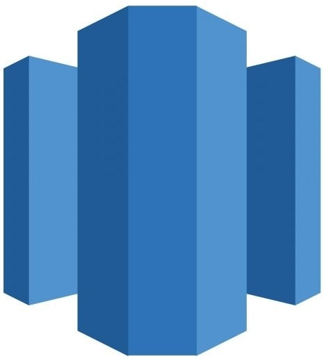
Para consolidar os dados da camada Gold em um ambiente de Data Warehouse, utilizamos o **Amazon Redshift Serverless** integrado ao **Databricks**. 

Abaixo, está resumidamente como foi feita a criação e configuração do ambiente:
### 🔧 Criação do **Workgroup e Namespace** no Redshift Serverless
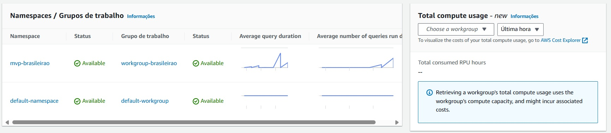

### 🌐 Habilitação de Acesso Público no Redshift Serverless
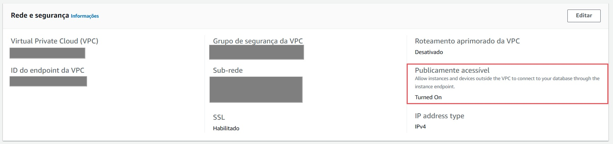

### 🔓 Liberação da Porta 5439 no Grupo de Segurança (VPC)
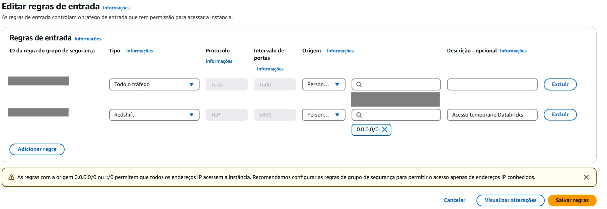

### 📦 Instalação do **Driver JDBC no Databricks**, com upload do `.jar` e reinicialização do cluster
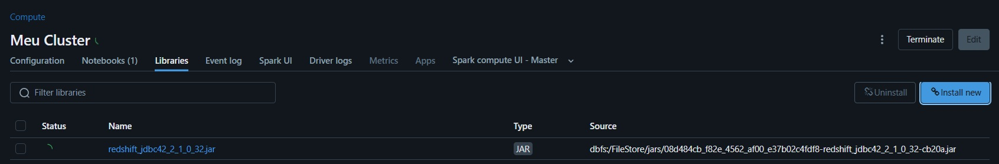

### 🔗 Definição dos **parâmetros de conexão**:
  - URL do Redshift Serverless
  - Nome do banco e da tabela
  - Usuário e senha
  - Driver: `com.amazon.redshift.jdbc.Driver`
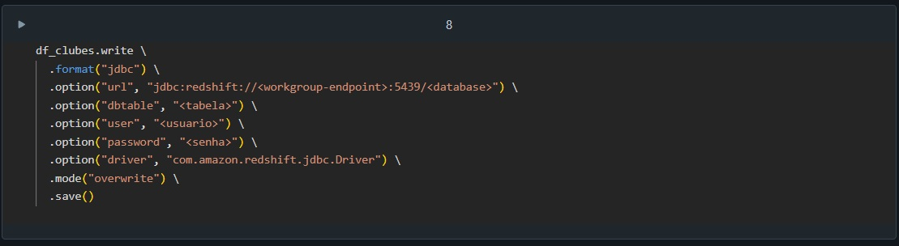

### 🔎 Validação da carga usando o **Query Editor v2** da AWS
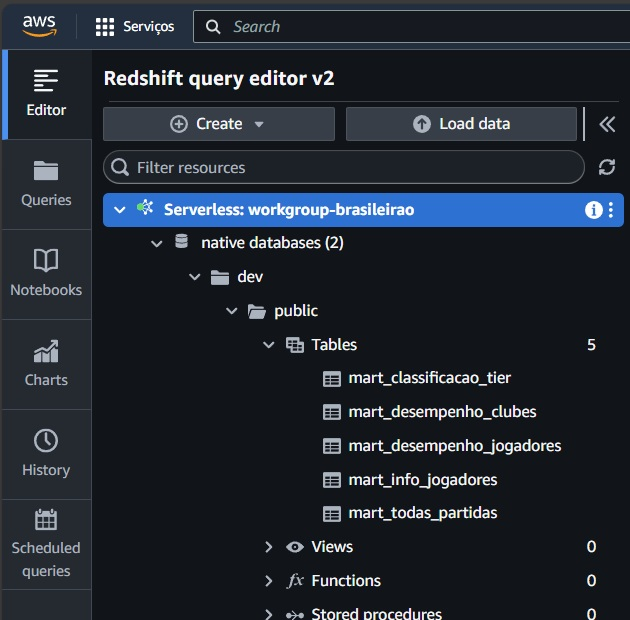


<br></br>


## 6. Integração Redshift + Databricks para Análises Finais 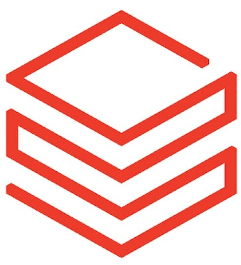 

Apesar das análises poderem ser feitas diretamente no Redshift, optamos por manter o ambiente de exploração dentro do Databricks, como forma de aprendizado e controle do fluxo de ida e volta dos dados entre as plataformas.

Essa abordagem nos permitiu:
- Consolidar os dados no Redshift como Data Warehouse final
- Aprender como fazer a conexão JDBC entre Databricks e Redshift
- Validar como fazer a leitura e consulta das tabelas Redshift dentro do Databricks
- Centralizar as análises e respostas no ambiente de notebooks

#### 6.1 Carregamento das Tabelas no Redshift | [06A-Carregamento-DW-Redshift-com-Databricks📎](notebooks/06A-Carregamento-DW-Redshift-com-Databricks.ipynb)
- Leitura dos arquivos .parquet da camada Gold diretamente do S3
- Escrita das tabelas analíticas (mart_desempenho_clubes, mart_desempenho_jogadores, mart_info_jogadores) no Redshift via JDBC
- Validação da carga usando o Query Editor v2

#### 6.2 Conexão entre Databricks e Redshift | [06B-Conexao-Databricks-com-DW-Redshift📎](notebooks/06B-Conexao-Databricks-com-DW-Redshift.ipynb)
- Estabelecimento de conexão JDBC para leitura das tabelas já carregadas no Redshift
- Leitura das tabelas do Redshift dentro do Databricks usando `spark.read.jdbc()`
- Confirmação da estrutura dos dados e visualização via PySpark


<br></br>


# 📊 Perguntas e Respostas do Projeto
## 📓 [`06C-Respostas.ipynb`](notebooks/06C-Respostas.ipynb)

Para finalizar o pipeline, criamos um caderno com as respostas baseadas nas perguntas definidas no início do projeto.

Essa etapa utilizou consultas **SQL com Spark** diretamente sobre as tabelas armazenadas no **Amazon Redshift**, permitindo análises rápidas e contextualizadas com base nos dados transformados na Camada Gold.

Algumas respostas foram complementadas com gráficos utilizando o matplotlib, trazendo mais clareza e facilitando a contextualização dos dados analisados.


